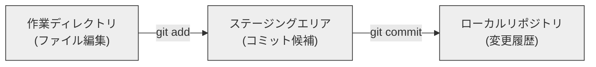

はい、承知いたしました。提供された3つのMarkdownファイルの内容を統合し、初心者研修用のスライド形式で再構成します。
各スライドは `---` で区切り、見出しや箇条書き、Mermaid図などを活用して分かりやすく表現します。

---

# GitとGitHub入門研修

ようこそ！バージョン管理の世界へ

---

## 本日の研修について

**対象者:**

*   GitやGitHubをこれから学び始める方
*   バージョン管理の基本的な概念を理解したい方
*   主要なコマンド (`commit`, `add`, `push`, `pull`など) の意味と使い方を習得したい方

**目的:**

*   GitとGitHubの基礎を確実に習得する。
*   基本的な操作を一人で行えるようになる。
*   チーム開発におけるGit/GitHubの役割を理解する。

---

## 本日のアジェンダ

1.  **はじめに：バージョン管理とは？**
2.  **GitとGitHubの基本**
    *   Gitとは？ リポジトリとは？
    *   GitHubとは？
    *   GitとGitHubの関係
3.  **Gitの基本操作 (ローカル編)**
    *   リポジトリの準備 (`clone`, `init`)
    *   変更の記録 (`add`, `commit`)
4.  **ブランチ入門**
    *   ブランチとは？ なぜ必要？
    *   ブランチ操作の基本
5.  **GitHubとの連携 (リモート編)**
    *   リモートリポジトリとの接続 (`remote`)
    *   変更の共有 (`push`, `pull`)
6.  **チーム開発の流れ (GitHub実践)**
    *   基本的なワークフロー
    *   プルリクエストとコードレビュー
7.  **困ったときには (トラブルシューティング入門)**
    *   コンフリクトとは？
    *   過去のバージョンに戻る
8.  **まとめと次のステップ**

---

## 1. はじめに：バージョン管理とは？

---

### なぜバージョン管理が必要？

ソフトウェア開発やドキュメント作成では、ファイルは頻繁に変更されます。

*   「あの機能を追加する前の状態に戻したい…」
*   「昨日編集したはずのファイルがどこかへ…」
*   「複数人で同じファイルを編集したら、誰の変更が正しいの？」

こんな経験はありませんか？

---

### バージョン管理システム (VCS) が解決！

バージョン管理システムは、ファイルの変更履歴を記録・追跡し、管理するための仕組みです。

**主なメリット:**

*   **変更履歴の追跡:** いつ、誰が、何を、なぜ変更したかを記録。
*   **過去のバージョンへの復元:** 間違えても安心。特定の時点の状態に戻せる。
*   **差分の確認:** 異なるバージョン間の変更点を比較できる。
*   **並行作業の容易化 (ブランチ):** 複数人での同時作業や、機能ごとの分離開発が可能。
*   **共同作業の円滑化:** チームでの開発効率が大幅に向上。

---

## 2. GitとGitHubの基本

---

### Gitとは何か？

*   **分散型バージョン管理システム (DVCS)** の一つ。
*   主にソースコードの管理に使われるが、テキストファイルなら何でも管理可能。
*   Linuxカーネルの開発者リーナス・トーバルズによって開発。
*   現在、世界で最も広く使われているバージョン管理システム。

**Gitの主な特徴:**

*   **高速性:** 多くの操作がローカルで完結するため速い。
*   **強力なブランチ機能:** 柔軟な開発フローを実現 (後述)。
*   **ローカルコミット:** ネットワーク接続なしで変更を記録できる。
*   **データの完全性:** 変更履歴が壊れにくい。

---

### リポジトリとは？

**リポジトリ (Repository)**: プロジェクトの全てを格納する場所

*   プロジェクトのファイルそのもの
*   ファイルの変更履歴
*   ブランチ情報、タグ情報
*   設定ファイル (`.gitignore` など)

**イメージ:** プロジェクトの「現在の姿」だけでなく、「過去の全ての姿」と「どのように変化してきたか」を記録するデータベース。

---

### `.git` フォルダの重要性

*   Gitリポジトリを初期化 (`git init`) したり、クローン (`git clone`) すると、プロジェクトのルートディレクトリに `.git` という隠しフォルダが作られます。
*   この `.git` フォルダが**リポジトリの本体**です。
*   ここに変更履歴、ブランチ情報など、Gitが管理する全ての情報が格納されます。
*   **絶対に手動で編集・削除しないでください！** (Gitコマンドを通じて操作します)

---

### ローカルリポジトリとリモートリポジトリ

*   **ローカルリポジトリ (Local Repository):**
    *   自分のPC上に存在するリポジトリ。
    *   日々の開発作業（編集、コミットなど）はここで行う。
    *   Gitは分散型なので、ローカルにも完全な履歴を持つ。

*   **リモートリポジトリ (Remote Repository):**
    *   ネットワーク上のサーバーなどに設置される共有リポジトリ。
    *   チームメンバーと変更を共有したり、バックアップしたりするために使用。
    *   GitHubなどのサービスがこれを提供。

---

### GitHubとは何か？

*   Gitリポジトリをインターネット上で保存・公開・共有するための**ホスティングサービス**。
    *   (GitLab, Bitbucketなども同様のサービス)
*   Gitの機能を活用し、チームでの共同作業を円滑にするためのプラットフォーム。

**GitHubの主な機能:**

*   リモートリポジトリの提供
*   **プルリクエスト (Pull Request):** コードレビューとマージ依頼の仕組み (後述)
*   **Issueトラッキング:** バグ報告、タスク管理
*   Wiki: プロジェクトドキュメント
*   GitHub Actions: CI/CD (ビルド、テスト、デプロイの自動化)
*   その他、プロジェクト管理ツールなど多数

---

### GitとGitHubの関係性

*   **Git:** バージョン管理を行うための「ツール」そのもの (ソフトウェア)。
    *   ローカルPCで動作。
*   **GitHub:** Gitリポジトリを「保管・共有する場所」(ウェブサービス)。
    *   インターネット経由でアクセス。

```mermaid
graph LR
    subgraph あなたのPC (ローカル)
        direction LR
        GitTool[Gitソフトウェア] --> LocalRepo[ローカルリポジトリ<br>(.gitフォルダと作業ファイル)]
    end

    subgraph インターネット (GitHub)
        direction LR
        GitHubService[GitHubプラットフォーム] --> RemoteRepo[リモートリポジトリ<br>(GitHub上)]
    end

    LocalRepo -- push (アップロード) / pull (ダウンロード) --> RemoteRepo
    User[開発者] -- ブラウザ/CLI --> GitHubService

    classDef git fill:#f9f,stroke:#333,stroke-width:2px;
    classDef github fill:#9cf,stroke:#333,stroke-width:2px;
    class GitTool git;
    class GitHubService github;
```

**Gitはローカルだけでも使えますが、GitHubと連携することでバックアップや共同作業が格段に便利になります。**

---

## 3. Gitの基本操作 (ローカル編)

---

### STEP 0: Gitのインストールと初期設定

*   **インストール:**
    *   各OS用のインストーラーを [git-scm.com](https://git-scm.com/) からダウンロードしてインストール。
*   **初期設定 (初回のみ):**
    *   ターミナル（コマンドプロンプトやGit Bashなど）で以下を実行。
    ```bash
    git config --global user.name "Your Name"
    git config --global user.email "your.email@example.com"
    ```
    *   ここで設定した名前とメールアドレスは、コミット履歴に記録されます。

---

### STEP 1: リポジトリの準備

**方法1: 新しくローカルリポジトリを作成する (`git init`)**

1.  プロジェクト用のフォルダを作成し、そのフォルダに移動します。
    ```bash
    mkdir my-project
    cd my-project
    ```
2.  `git init` コマンドを実行します。
    ```bash
    git init
    ```
    *   カレントディレクトリに `.git` フォルダが作成され、Gitリポジトリとして初期化されます。

**方法2: 既存のリモートリポジトリを複製する (`git clone`)**

*   GitHubなどにある既存のリポジトリをローカルにコピーしてきたい場合。
    ```bash
    git clone <リモートリポジトリのURL>
    ```
    例: `git clone https://github.com/username/repository-name.git`
    *   リポジトリ名のフォルダが作成され、その中に全ファイルと履歴がダウンロードされます。
    *   自動的にリモートリポジトリとの接続設定も行われます (後述)。

---

### 変更を記録する3ステップの基本

Gitで変更を記録するには、基本的に以下の3つのエリア（状態）を意識します。

1.  **作業ディレクトリ (Working Directory):**
    *   実際にファイルを編集する場所。
2.  **ステージングエリア (Staging Area / Index):**
    *   次のコミットに含める変更を準備する場所。
    *   コミットする変更を選択できる。
3.  **ローカルリポジトリ (.git directory):**
    *   コミットされた変更履歴が実際に保存される場所。



---

### STEP 2: 変更をステージングエリアに追加 (`git add`)

作業ディレクトリでファイルを変更・新規作成したら、それをコミット対象としてステージングエリアに追加します。

*   **特定のファイルを追加:**
    ```bash
    git add ファイル名1 ファイル名2
    git add README.md style.css
    ```
*   **カレントディレクトリ以下の全ての変更を追加 (よく使う):**
    ```bash
    git add .
    ```
*   **変更状況の確認 (`git status`):**
    *   どのファイルが変更されたか、ステージングされているかなどを確認できます。
    *   こまめに実行して状況を把握しましょう！

**なぜ `add` (ステージング) が必要？**
*   コミットに含める変更を細かくコントロールできる。
    *   「この変更は今回のコミットに含めたいけど、あの変更はまだ作業中だから次回にしたい」といった場合に便利。
*   関連する変更だけを1つのコミットにまとめることができる。

---

### STEP 3: 変更をローカルリポジトリに記録 (`git commit`)

ステージングエリアに準備した変更を、メッセージと共にローカルリポジトリに記録します。

```bash
git commit -m "ここにコミットメッセージを書く"
```
例: `git commit -m "Add user login feature"`

**コミットとは？**
*   プロジェクトの現在の状態の**スナップショット**（写真のようなもの）を保存する操作。
*   ビデオゲームの「**セーブポイント**」のようなもの。
    *   区切りの良いところでセーブすれば、後からその時点に戻れる。
*   コミットには以下の情報が含まれます:
    *   変更されたファイルとその内容のスナップショット
    *   コミットメッセージ (非常に重要！)
    *   作成者、日時
    *   親コミットのID (これにより履歴が繋がる)

---

### 分かりやすいコミットメッセージの重要性

コミットメッセージは、**「このコミットで何をしたのか」**を伝えるためのものです。

*   将来の自分や他のチームメンバーが履歴を理解する上で非常に重要。
*   **明確で簡潔なメッセージを心がけましょう。**

**良いコミットメッセージのヒント (例):**

*   **要約行 (1行目) は50文字以内で簡潔に。**
    *   例: `feat: ユーザー認証機能の追加` (体言止めや動詞の原形)
    *   例: `fix: ログイン時のリダイレクト不具合を修正`
*   **必要なら空行を挟んで詳細を記述。**
*   **変更の種類を示す接頭辞 (Prefix) を使う (チームのルールによる):**
    *   `feat:` (新機能), `fix:` (バグ修正), `docs:` (ドキュメント), `style:` (コードスタイル), `refactor:` (リファクタリング), `test:` (テスト), `chore:` (その他雑務)
*   **過去形ではなく現在形や命令形で書くのが一般的。**

---

### 【補足】コミットに関する便利なコマンド

*   **`git commit -a -m "メッセージ"` または `git commit -am "メッセージ"`:**
    *   **既にGitの追跡対象のファイル**の変更を自動で `add` して `commit` するショートカット。
    *   **注意:** 新規作成したファイル (まだ一度も `add` されていないファイル) は対象外。
    *   便利ですが、意図しない変更を含めないよう `git status` で確認してから使うのが安全。

*   **`git log`:**
    *   コミット履歴を表示します。
    *   オプションで表示形式をカスタマイズ可能 (例: `git log --oneline --graph`)。

---

### コミットが保存するもの：スナップショット

Gitのコミットは、その時点でのプロジェクト全体のファイル内容の**スナップショット**を記録します。

*   例えば、`main.py` というファイルをコミットC1, C2, C3で変更した場合:
    *   C1にはその時点の `main.py` (バージョン1)
    *   C2には変更後の `main.py` (バージョン2)
    *   C3にはさらに変更後の `main.py` (バージョン3)
    がそれぞれ記録され、いつでも各バージョンにアクセスできます。

**【補足】Git内部の効率的なデータ管理**
実際には毎回全ファイルをコピーするのではなく、変更がないファイルは再利用したり、差分ではなくコンテンツ自体を効率的に保存する仕組みになっています。ユーザーはこれを意識せずともメリットを享受できます。

---

## 4. ブランチ入門

---

### ブランチとは？

**ブランチ (Branch):** プロジェクトの履歴を分岐させて、複数の作業を並行して進めるための仕組み。

**イメージ:**

*   **木の幹と枝:**
    *   `main`ブランチ (幹): プロジェクトの主要な開発ライン。安定版。
    *   フィーチャーブランチ (枝): 新機能開発やバグ修正など、特定の作業を行う独立したライン。

*   **下書きと清書:**
    *   `main`ブランチ (清書): リリース可能なコード。
    *   フィーチャーブランチ (下書き): アイデアを試し、修正する作業スペース。

---

### なぜブランチが必要？ ブランチのメリット

*   **安全な開発:**
    *   `main`ブランチ (安定版) を直接変更せず、別のブランチで作業できる。
    *   バグや未完成の機能が `main` に混入するリスクを低減。
*   **並行作業の実現:**
    *   複数人がそれぞれ異なるブランチで同時に作業を進められる。
    *   互いの作業が干渉しにくい。
*   **機能ごとの管理:**
    *   機能AはブランチA、機能BはブランチB、と分けて開発・管理しやすい。
*   **実験的な試みの容易化:**
    *   新しい技術や大きな変更を試す際、専用ブランチで行えば本体に影響なし。
    *   失敗したらそのブランチを破棄するだけ。
*   **コードレビューの促進 (GitHubなど):**
    *   ブランチの変更を `main` に取り込む前にレビューできる (プルリクエスト)。

---

### `main` ブランチの役割 (旧 `master`)

*   多くのGitリポジトリでデフォルトとなる主要なブランチ。
*   **プロジェクトの「幹」となる流れ。**
*   常に**安定していて、いつでもリリース可能な状態**を保つべきブランチ。
*   直接このブランチにコミットすることは原則として行わず、他の作業ブランチからの変更をレビュー後に統合（マージ）するのが一般的。

**【補足】ブランチ名は `main` へ**
以前は `master` がデフォルトでしたが、近年は `main` が推奨され、新しいリポジトリでは `main` が標準です。

---

### ブランチはGitの機能？ GitHubの機能？

**ブランチという概念・仕組みそのものは、主にGitの機能です。**

*   **Git:**
    *   ブランチの作成、切り替え、統合 (マージ) などのコア機能を提供。
    *   ローカルリポジトリで全て操作可能。
*   **GitHub:**
    *   Gitのブランチ機能を活用して、共同作業を支援。
    *   ローカルで作ったブランチを共有したり、プルリクエストでレビューしたりできる。

---

### 基本的なブランチ操作コマンド

*   **ブランチの一覧表示:**
    ```bash
    git branch
    ```
    *   現在いるブランチには `*` が付きます。

*   **新しいブランチの作成:**
    ```bash
    git branch <新しいブランチ名>
    ```
    例: `git branch feature/new-login`
    *   現在のブランチの最新コミットから新しいブランチを作成 (まだ移動はしない)。

*   **ブランチの切り替え (移動):**
    ```bash
    git switch <移動先のブランチ名>
    # または古いコマンド: git checkout <移動先のブランチ名>
    ```
    例: `git switch feature/new-login`
    *   作業ディレクトリの内容が、指定したブランチの状態に変わります。

*   **ブランチの作成と切り替えを同時に:**
    ```bash
    git switch -c <新しいブランチ名>
    # または古いコマンド: git checkout -b <新しいブランチ名>
    ```
    例: `git switch -c feature/user-profile` (よく使います！)

---

### 「ブランチを切る」とは？

開発現場でよく使われる「ブランチを切る」という表現。
これは「新しいブランチを作成する」という意味です。

**イメージの誤解に注意:**
*   「切り離す」のではなく**「現在の開発ラインから分岐し、その時点の状態をコピーして新しい作業ラインを作る」**イメージ。
*   作成直後は、元のブランチと全く同じ内容です。そこから独立して編集を進めます。

**目的:** メインのラインに影響を与えず、独立した編集環境を確保するため。

---

### ブランチの統合 (`git merge`)

異なるブランチで行った変更を、別のブランチに統合（合流）する操作です。

**手順 (例: `feature/new-login` ブランチの変更を `main` ブランチに取り込む):**

1.  **取り込み先のブランチ (`main`) に移動する:**
    ```bash
    git switch main
    ```
2.  **現在のブランチ (`main`) を最新化する (もしリモートがあるなら):**
    ```bash
    git pull origin main  # (詳細は後述)
    ```
3.  **統合したいブランチ (`feature/new-login`) を指定してマージを実行:**
    ```bash
    git merge feature/new-login
    ```
    *   これで `main` ブランチに `feature/new-login` の変更が取り込まれます。

---

### マージの種類 (簡単に)

*   **Fast-forwardマージ:**
    *   取り込み先ブランチ (`main`) が、分岐後に進んでいない場合。
    *   `main` のポインタが、取り込むブランチの先端まで早送りされるだけ。
    *   履歴は一直線になる。

*   **3-wayマージ (マージコミット):**
    *   両方のブランチが分岐後にそれぞれ進んでいる場合。
    *   Gitが共通の祖先と両ブランチの先端を比較し、変更を統合。
    *   統合結果を記録する新しい「マージコミット」が作成される。
    *   履歴に分岐と合流が記録される。

---

### 不要なブランチの削除

マージが完了し、不要になったブランチは削除して整理しましょう。

*   **マージ済みのブランチを安全に削除:**
    ```bash
    git branch -d <削除したいブランチ名>
    ```
    例: `git branch -d feature/new-login`
    *   `-d` は、マージ済みでないとエラーになります (安全策)。

*   **マージされていないブランチを強制的に削除 (注意！):**
    ```bash
    git branch -D <削除したいブランチ名>
    ```
    *   `-D` は、変更が失われる可能性があるので慎重に。

**注意:** 現在チェックアウトしているブランチは削除できません。別のブランチに移動してから削除してください。

---

### ブランチ作成時のGit内部の動き (少し詳しく)

*   ブランチは、特定のコミットを指す**軽量なポインタ (参照)** です。
*   ファイル群を丸ごとコピーするわけではありません。
*   新しいブランチを作っても、新しい `.git` フォルダは作られません。
    *   既存の `.git` フォルダ内で、ブランチ情報 (どのコミットを指すか) が記録されます。
    *   `.git/refs/heads/` ディレクトリ内にブランチ名のファイルが作られ、コミットIDが書かれます。
*   だからブランチの作成・削除は非常に高速！

**ブランチ切り替え時:** 作業ディレクトリのファイルが、切り替え先ブランチが指すコミットの状態に更新されます。

---

## 5. GitHubとの連携 (リモート編)

---

### リモートリポジトリの役割 再確認

*   **コードの共有:** チームメンバー間で変更を共有。
*   **バックアップ:** ローカルPCが壊れても安心。
*   **共同作業のハブ:** プルリクエストなどでレビューや議論。

---

### リモートリポジトリの指定

ローカルリポジトリがどのリモートリポジトリと通信するかを設定します。

*   **`git clone` した場合は自動設定:**
    *   クローン元のURLが `origin` という名前で自動的に登録されます。
    *   `origin` は、慣習的に使われる主要なリモートリポジトリのデフォルト名です。

*   **既存のローカルリポジトリに手動で追加する場合 (`git remote add`):**
    ```bash
    git remote add <リモート名> <リモートリポジトリのURL>
    ```
    例: `git remote add origin https://github.com/username/repository-name.git`

*   **登録済みリモートの確認:**
    ```bash
    git remote -v
    ```
    *   リモート名とURLが表示されます。

---

### `git push`: ローカルの変更をリモートへ

ローカルリポジトリで行ったコミット（変更履歴）を、リモートリポジトリに送信（アップロード）します。

```bash
git push <リモート名> <ローカルブランチ名>
```
例: `git push origin main`
(ローカルの `main` ブランチの変更を、`origin` リモートの `main` ブランチにプッシュ)

**初回プッシュ時の `-u` オプション:**
ローカルで新しく作ったブランチを初めてリモートにプッシュする場合:
```bash
git push -u origin <ブランチ名>
# または git push --set-upstream origin <ブランチ名>
```
例: `git push -u origin feature/new-login`
*   リモートに同じ名前のブランチが作成され、ローカルブランチとリモートブランチが紐付けられます (アップストリーム設定)。
*   次回以降、そのブランチでは `git push` だけでOKになります。

---

### `git pull`: リモートの変更をローカルへ

リモートリポジトリの最新の変更履歴をローカルリポジトリに取得（ダウンロード）し、現在のローカルブランチに統合（マージ）します。

```bash
git pull <リモート名> <リモートブランチ名>
```
例: (ローカルの `main` ブランチにいる場合)
`git pull origin main` (リモート `origin` の `main` ブランチの最新を取り込む)

*   もしアップストリーム設定がされていれば、単に `git pull` だけでOK。
*   チーム開発では、作業開始前や定期的に `git pull` して、他の人の変更を取り込むことが重要です。

---

### 【補足】`git fetch` と `git pull` の違い

*   **`git fetch`:**
    *   リモートリポジトリの最新情報をローカルの `.git` フォルダ内にダウンロードするだけ。
    *   **作業ディレクトリのファイルは変更されません。**
    *   リモートの変更内容を確認してから、安全にマージしたい場合に使う。
    *   ローカルのリモート追跡ブランチ (例: `origin/main`) が更新されます。

*   **`git pull` は、実質的に `git fetch` + `git merge` を一度に行うコマンドです。**
    1.  `git fetch`: リモートの最新情報をダウンロード。
    2.  `git merge <追跡しているリモートブランチ>`: ダウンロードした情報を現在のローカルブランチにマージ。

---

## 6. チーム開発の流れ (GitHub実践)

---

### チーム開発の基本的なワークフロー (GitHub Flow風)

```mermaid
graph LR
    RemoteMain[GitHub リモートリポジトリ<br>(mainブランチ)] -->|1. クローン / プル<br>(ローカルへ最新版取得)| LocalPC[あなたのローカルPC]
    LocalPC -->|2. 作業ブランチ作成<br>(例: feature/task-A)| LocalFeatureBranch[ローカル作業ブランチ<br>(feature/task-A)]
    LocalFeatureBranch -->|3. コーディング・変更作業| LocalFeatureBranch
    LocalFeatureBranch -->|4. コミット<br>(ローカルに記録)| LocalFeatureBranch
    LocalFeatureBranch -->|5. プッシュ<br>(リモートに共有)| RemoteFeatureBranch[リモート作業ブランチ<br>(GitHub上 feature/task-A)]
    RemoteFeatureBranch -->|6. プルリクエスト作成<br>(mainへのマージを依頼)| RemoteMain
    RemoteMain -- レビュー担当者 -->|7. コードレビュー<br>(GitHub上で議論)| RemoteMain
    RemoteMain -- 承認後 -->|8. マージ<br>(mainに変更を統合)| RemoteMain

    subgraph GitHub上
        direction LR
        RemoteFeatureBranch
        RemoteMain
    end
    subgraph ローカルPC
        direction LR
        LocalPC
        LocalFeatureBranch
    end
```
**図. Git/GitHubを用いた基本的な開発サイクル**

---

### STEP 1: リポジトリの準備と最新化

1.  **クローン (初回のみ):**
    ```bash
    git clone <リポジトリURL>
    cd <リポジトリ名>
    ```
2.  **`main` ブランチに移動し、最新化:**
    ```bash
    git switch main
    git pull origin main
    ```
    *   **【コラム】`clone` 直後の `pull` は必要か？**
        *   理論上、直後なら不要な場合も。しかし、僅かな時間差や「常に最新から始める」習慣のため、実施を推奨。

---

### STEP 2: 作業用ブランチの作成と切り替え

`main` ブランチから、新しいタスク専用のブランチを作成して移動します。
**`main` ブランチで直接作業しないこと！**

```bash
git switch -c <新しいブランチ名>
```
例: `git switch -c feature/add-user-settings`

**効果的なブランチ命名規則 (チームで決めよう):**
*   `feature/` または `feat/`: 機能追加 (例: `feature/user-auth`)
*   `fix/` または `bugfix/`: バグ修正 (例: `fix/login-error`)
*   `docs/`: ドキュメント (例: `docs/update-readme`)
*   Issue番号を含める (例: `feature/PROJ-123-new-payment`)

---

### STEP 3: コーディングとローカルでの変更記録

作業ブランチでコードを編集し、こまめにコミットします。

1.  **ファイル編集**
2.  **ステージング:**
    ```bash
    git add .
    # または git add <ファイル名>
    ```
3.  **コミット:**
    ```bash
    git commit -m "分かりやすいコミットメッセージ"
    ```
    *   `git status` で状況を確認しながら進めましょう。

---

### STEP 4: リモートリポジトリへの変更共有

ローカルでのコミットがある程度進んだら、作業ブランチをリモート (GitHub) にプッシュします。

*   **初回プッシュ (アップストリーム設定も同時に):**
    ```bash
    git push -u origin <作業ブランチ名>
    ```
    例: `git push -u origin feature/add-user-settings`

*   **2回目以降のプッシュ (同じブランチへ):**
    ```bash
    git push
    ```
*   定期的なプッシュでバックアップにもなり、他のメンバーも進捗を確認できます。

---

### STEP 5: プルリクエストによるレビューとマージ (GitHub上)

作業ブランチでの開発が完了したら、変更を `main` ブランチに取り込んでもらうために**プルリクエスト (Pull Request, PR)** を作成します。

**プルリクエストとは？**
*   あなたの変更 (作業ブランチ) を `main` ブランチにマージしてほしいという「お願い」。
*   変更内容についてチームで議論・レビューするための仕組み。
*   コードの品質向上、バグ早期発見、知識共有に繋がる。

---

### プルリクエストの作成 (GitHub上)

1.  作業ブランチをプッシュすると、GitHubのリポジトリページにPR作成を促す通知が出ることが多いです。
2.  または、「Pull requests」タブ → 「New pull request」から作成。
3.  **比較ブランチの設定:**
    *   `base` ブランチ: マージ先 (例: `main`)
    *   `compare` ブランチ: マージ元 (あなたの作業ブランチ)
4.  **情報を入力:**
    *   タイトル: PRの内容を簡潔に (例: `ユーザー設定機能の追加`)
    *   説明: 変更目的、内容、関連Issue、レビューしてほしい点など詳細に。
    *   レビュアー、アサイニー、ラベルなどを指定。
5.  「Create pull request」で作成。

---

### コードレビューのプロセス

1.  レビュアーはPRの変更内容 (`Files changed` タブ) を確認し、コメントや修正提案を行う。
2.  PR作成者はレビューコメントに対応。
    *   質問に回答。
    *   修正点があれば、ローカルの作業ブランチでコードを修正 → コミット → プッシュ。
        ```bash
        # (ローカルの作業ブランチで)
        # コード修正
        git add .
        git commit -m "レビュー指摘対応: 〇〇を修正"
        git push
        ```
        *   プッシュするとPRは自動的に更新されます。
3.  レビューと修正を繰り返し、レビュアーが承認 (Approve) したらマージへ。

---

### 変更の取り込み (マージ)

レビュアーから承認が得られたら、GitHub上でPRを `main` ブランチにマージします。

*   PRページに「Merge pull request」ボタンが表示されます。
*   マージ方法 (プロジェクトルールによる):
    *   **Create a merge commit (デフォルト):** 作業ブランチの履歴を残し、マージコミットを作成。
    *   **Squash and merge:** 作業ブランチのコミットを1つにまとめてマージ。`main` の履歴が綺麗に。
    *   **Rebase and merge:** 作業ブランチのコミットを `main` の先端に付け替えてマージ。`main` の履歴が一直線に。

マージ完了後、PRはクローズされます。

---

### STEP 6: 作業後のクリーンアップ

マージ済みの作業ブランチは不要になることが多いので、削除して整理します。

*   **リモートブランチの削除 (GitHub上):**
    *   PRマージ時に「Delete branch」ボタンが表示されることが多い。
    *   またはコマンドで: `git push origin --delete <作業ブランチ名>`

*   **ローカルブランチの削除:**
    1.  `main` ブランチに移動し、最新化:
        ```bash
        git switch main
        git pull origin main
        ```
    2.  ローカルの作業ブランチを削除:
        ```bash
        git branch -d <作業ブランチ名>
        ```

これで1サイクル完了！次のタスクへ。

---

## 7. 困ったときには (トラブルシューティング入門)

---

### コンフリクト (衝突) とは？

複数の開発者が、同じファイルの同じ箇所を同時に編集し、それらをマージしようとすると発生します。
Gitがどちらの変更を正として採用すべきか自動で判断できない状態です。

主に `git pull` や `git merge` 時に発生。
コンフリクトが発生すると、Gitは該当ファイル内に以下のようなマーカーを挿入します:
```
<<<<<<< HEAD
あなたのローカルでの変更内容 (現在のブランチの変更)
=======
リモート（またはマージ元ブランチ）の変更内容
>>>>>>> branch-name (またはコミットハッシュ)
```

---

### コンフリクトの基本的な対処法

1.  コンフリクトが発生したファイルをエディタで開く。
2.  マーカー (`<<<<<<<`, `=======`, `>>>>>>>`) と、不要な方のコードを手動で編集し、最終的に残したい形にする (マーカー自体も削除)。
3.  編集後、ファイルを保存。
4.  修正したファイルを `git add` でステージング:
    ```bash
    git add <コンフリクトしたファイル名>
    ```
5.  全てのコンフリクトを解消したら、`git commit` を実行 (マージコミットが作成される)。
    *   もし `git pull` 中のコンフリクトで `rebase` が行われた場合は `git rebase --continue` など、状況によりコマンドが異なります。Gitの指示に従いましょう。

**コンフリクトを減らすには:**
*   こまめに `pull` する。
*   作業ブランチの期間を短くする。
*   担当範囲を明確にする。
*   困ったらチームに相談！

---

### 過去のバージョンに戻りたいとき

状況に応じていくつかの方法があります。

*   **`git checkout <コミットID>` (分離HEAD状態):**
    *   作業ディレクトリを指定したコミット時点の状態に戻して確認できる。
    *   **注意:** この状態で直接コミットすると、どのブランチにも属さないコミットになる可能性。
    *   過去の状態から新しいブランチを作りたい場合に使う (`git switch -c new-branch <コミットID>`)。
    *   戻るには `git switch <元のブランチ名>`。

*   **`git reset --hard <コミットID>` (履歴の巻き戻し):**
    *   現在のブランチの先端を指定したコミットまで完全に移動。
    *   指定コミット以降のコミットは (ローカルからは) 失われる。
    *   **注意:** 強力なコマンド。リモートにプッシュ済みの履歴を書き換えると大問題になる可能性。慎重に！

*   **`git revert <コミットID>` (変更の打ち消し):**
    *   指定したコミットで行われた変更を「打ち消す」新しいコミットを作成する。
    *   元のコミットは履歴に残る。
    *   共有ブランチ上で特定の変更を安全に取り消したい場合に推奨。

**まずは `git log` で戻りたいコミットIDを確認しましょう。**

---

### 「作業前にコミット」の真意

「ブランチを切り替える前や `pull` する前にはコミットして」とよく言われます。
これは、「**ローカルでの作業中の変更を失わないように、または他の操作と混ざらないように、一旦ローカルリポジトリに記録（コミット）しておきましょう**」という意味合いが強いです。
または、`git stash` で一時退避させる方法もあります。
作業ディレクトリをクリーンな状態にしてから、ブランチ切り替えやマージを行うのが安全です。

---

## 8. まとめと次のステップ

---

### 本日のまとめ

*   **バージョン管理**の重要性とGitの役割を理解した。
*   **Git**は分散型バージョン管理ツール、**GitHub**はGitリポジトリのホスティングサービス。
*   **リポジトリ**、**.gitフォルダ**の概念を学んだ。
*   基本的なGit操作:
    *   ローカル: `init`, `clone`, `add`, `commit`, `status`, `log`
    *   ブランチ: `branch`, `switch (-c)`, `merge`, `branch -d`
    *   リモート: `remote`, `push`, `pull` (fetch + merge)
*   **チーム開発のワークフロー**と**プルリクエスト**の概要を掴んだ。
*   **コンフリクト**対処の基本と、過去バージョンへのアクセス方法に触れた。

---

### 今後の学習のために

*   **実際に手を動かしてみましょう！**
    *   個人プロジェクトでGitを使ってみる。
    *   GitHubでリポジトリを作って練習する。
*   **チームのルールを理解する:**
    *   ブランチ戦略、コミットメッセージ規約など。
*   **より高度な機能へ:**
    *   `rebase`, `stash`, `tag`, `cherry-pick` など。
    *   Git GUIツール (SourceTree, VSCode内蔵Gitなど) も便利。
*   **公式ドキュメントや解説サイトを参照:**
    *   Pro Git Book (日本語版): [https://git-scm.com/book/ja/v2](https://git-scm.com/book/ja/v2)
    *   GitHub Docs: [https://docs.github.com/ja](https://docs.github.com/ja)

---

### 質疑応答

ご清聴ありがとうございました！

---
```

```